# Hedera DeFi AI Agent 🚀

## 🔗 Related Repositories

- **Frontend**: [Hedron Frontend](https://github.com/rofergon/Hedron_Frontend) - User interface for the Hedera DeFi AI Agent
- **AutoSwapLimit Contract**: [AutomationSwapLimit](https://github.com/rofergon/AutomationSwapLimit) - Intermediate contract for limit orders

## 📜 Deployed Contracts

- **MockPriceOracle**: [0.0.6506125](https://hashscan.io/testnet/contract/0.0.6506125)
- **AutoSwapLimit**: [0.0.6506134](https://hashscan.io/testnet/contract/0.0.6506134)

## 📋 Project Description

An artificial intelligence agent specialized in the Hedera Hashgraph DeFi ecosystem that helps both novice and experienced users navigate and optimize their investments through integrated SaucerSwap DEX operations, Bonzo Finance lending protocols, and advanced AutoSwapLimit trading strategies. The agent provides real-time analysis and automated execution capabilities.

## 🚀 Quick Access

| 🔗 **Quick Navigation** | 📂 **Path** | 📄 **Description** |
|------------------------|-------------|-------------------|
| 🏦 **DeFi Tools** | [typescript/src/shared/tools/defi/](typescript/src/shared/tools/defi/) | Complete DeFi integration suite |
| 🤖 **WebSocket Agent** | [typescript/examples/langchain/websocket-agent.ts](typescript/examples/langchain/websocket-agent.ts) | Main AI agent server |
| 🔧 **Message Handlers** | [typescript/examples/langchain/handlers/](typescript/examples/langchain/handlers/) | WebSocket message processing |
| 📊 **Examples** | [typescript/examples/](typescript/examples/) | Implementation examples |


## 🎯 Problem Solved

### For Novice Users:
- **Complexity of the DeFi ecosystem**: New users feel overwhelmed by the number of protocols and available options
- **Lack of technical knowledge**: Difficulty understanding concepts like liquidity mining, yield farming, lending, staking
- **Risk of losses**: Making investment decisions without enough information can result in significant losses
- **Fragmented information**: Data is scattered across multiple platforms without a unified view

### For Experienced Users:
- **Inefficient manual monitoring**: Manually reviewing multiple protocols consumes valuable time
- **Missed opportunities**: The best arbitrage and yield opportunities can go unnoticed
- **Complex comparative analysis**: Comparing yields, risks, and features between protocols takes a lot of time
- **Lack of automation**: Need for tools that facilitate data-driven decision making

## 💡 How It Solves the Problem

### 🤖 Intelligent AI Agent
- **Automated analysis**: Continuous monitoring of SaucerSwap, Bonzo Finance, and AutoSwapLimit
- **Personalized recommendations**: Suggestions based on the user's risk profile and objectives
- **Conversational interface**: Natural interaction via WebSocket for real-time queries
- **Persistent context**: Conversation memory that maintains session context

### 📊 Real-Time Multi-Protocol Analysis

#### Integration with APIs and Smart Contracts:
- **REST APIs**: Direct connection to platform data endpoints
- **Smart contracts**: Native interaction with on-chain protocols
- **Intelligent rate limiting**: Optimized request management to avoid limitations
- **Smart cache**: 30-second cache system to optimize performance

### 🏦 Integrated DeFi Platforms

#### 🥇 SaucerSwap
- **Type**: DEX with AMM (Automated Market Maker)
- **Features**: 
  - Token swap quotes and execution
  - Real-time price discovery
  - Single-sided staking (Infinity Pools)
  - Liquidity analysis
  - Advanced trading with AutoSwapLimit orders
- **Dominance**: +44% of total Hedera DeFi TVL and +60% of unique active wallets

#### 💰 Bonzo Finance
- **Type**: Lending & borrowing protocol (Aave V2 fork)
- **Features**:
  - Supply assets to earn interest
  - Real-time lending rates monitoring
  - Portfolio analysis and optimization
  - Risk assessment tools
- **TVL**: Steady growth post-launch (~$25M in Q4 2024, later ~$38M)

#### 🎯 AutoSwapLimit (SaucerSwap Integration)
- **Type**: Advanced limit order system
- **Features**:
  - Automated limit orders execution
  - Price monitoring and alerts
  - Order management and cancellation
  - Strategic trading automation

## 🛠️ Technical Architecture

### 🔄 Agent Flow Diagram

```mermaid
graph TD
    A[Client conecta WebSocket] --> B{Tipo de mensaje}
    
    B -->|CONNECTION_AUTH| C[Autenticar Usuario]
    C --> D[Crear Conexión de Usuario]
    D --> E[Inicializar Agente LLM]
    E --> F[Cargar Hedera Tools]
    F --> G[Cargar DeFi Tools]
    G --> H[Usuario Autenticado ✅]
    
    B -->|USER_MESSAGE| I[Procesar Mensaje del Usuario]
    I --> J[Verificar Autenticación]
    J --> K{¿Usuario Autenticado?}
    K -->|No| L[Enviar Error de Autenticación]
    K -->|Sí| M[Cargar Memoria de Conversación]
    M --> N[Ejecutar Agente LLM]
    N --> O[Agente analiza mensaje con herramientas]
    
    O --> P{¿Tipo de respuesta?}
    P -->|Respuesta de texto| Q[AGENT_RESPONSE]
    P -->|Transacción requerida| R[TRANSACTION_TO_SIGN]
    P -->|Quote de intercambio| S[SWAP_QUOTE]
    P -->|Mensaje del sistema| T[SYSTEM_MESSAGE]
    
    Q --> U[Enviar respuesta al cliente]
    R --> V[Cliente firma transacción]
    S --> W[Mostrar cotización estructurada]
    T --> X[Mostrar mensaje del sistema]
    
    V --> Y[TRANSACTION_RESULT]
    B -->|TRANSACTION_RESULT| Z[Procesar resultado de transacción]
    Z --> AA[Actualizar estado del agente]
    AA --> U
    
    G --> BB[DeFi Tools Loading]
    BB --> CC[🏦 Bonzo Finance<br/>- Lending/Borrowing<br/>- Portfolio Analysis<br/>- Interest Rates]
    BB --> DD[🥇 SaucerSwap<br/>- Token Swaps<br/>- Liquidity Pools<br/>- Price Quotes]
    BB --> EE[🎯 AutoSwapLimit<br/>- Limit Orders<br/>- Order Management<br/>- Trading Automation]
    BB --> FF[📊 Analytics<br/>- Real-time Data<br/>- Account Balances<br/>- Market Monitoring]
    
    CC --> GG[Hedera Native Tools]
    DD --> GG
    EE --> GG
    FF --> GG
    
    GG --> HH[🔗 HTS - Token Operations<br/>🗣️ HCS - Consensus Messages<br/>💰 HBAR - Transfers & Balances<br/>📋 Account Queries]
```



### 🔌 WebSocket Communication Flow

1. **Connection Establishment**: Client connects to WebSocket server
2. **Authentication**: User sends `CONNECTION_AUTH` with their Hedera account ID
3. **Agent Initialization**: System creates personalized agent with tools and memory
4. **Message Processing**: Agent processes user queries using integrated DeFi and Hedera tools
5. **Response Generation**: AI generates responses, quotes, or transaction requests
6. **Transaction Handling**: Client signs transactions externally, reports results back

### 🧰 Integrated Tools Architecture

#### **🏦 DeFi Tools Suite** → [📂 Browse DeFi Tools](typescript/src/shared/tools/defi/)

- **[Bonzo Finance](typescript/src/shared/tools/defi/bonzo/)**: Lending & borrowing protocol integration
- **[SaucerSwap API](typescript/src/shared/tools/defi/saucerswap-api/)**: DEX market data and analytics
- **[SaucerSwap Quote](typescript/src/shared/tools/defi/SaucerSwap-Quote/)**: Real-time swap price quotes
- **[SaucerSwap Router](typescript/src/shared/tools/defi/Saucer-Swap/)**: Swap execution tools
- **[Infinity Pools](typescript/src/shared/tools/defi/SaucerSwap-InfinityPool/)**: Single-sided staking
- **[AutoSwapLimit](typescript/src/shared/tools/defi/autoswap-limit/)**: Advanced limit order system
- **[AutoSwap Queries](typescript/src/shared/tools/defi/autoswap-limit-queries/)**: Order monitoring tools

#### **🔗 Hedera Native Tools**
- **HTS (Hedera Token Service)**: Token operations and management
- **HCS (Hedera Consensus Service)**: Messaging and consensus
- **HBAR Operations**: Transfers, balance queries, account management
- **Account Queries**: Real-time account information and token balances

### 📡 WebSocket Message Types

| Message Type | Direction | Purpose |
|-------------|-----------|---------|
| `CONNECTION_AUTH` | Client → Agent | User authentication with account ID |
| `USER_MESSAGE` | Client → Agent | User queries and instructions |
| `AGENT_RESPONSE` | Agent → Client | AI-generated text responses |
| `SWAP_QUOTE` | Agent → Client | Structured swap quotation data |
| `TRANSACTION_TO_SIGN` | Agent → Client | Transaction bytes requiring signature |
| `TRANSACTION_RESULT` | Client → Agent | Signed transaction confirmation |
| `SYSTEM_MESSAGE` | Agent → Client | System notifications and errors |

### 🧠 Memory Management
- **Persistent Context**: Each user maintains conversation history
- **Token Management**: Intelligent memory pruning to optimize performance
- **Session Isolation**: Each WebSocket connection has independent context
- **Auto Cleanup**: Memory cleared on disconnection

### 🤖 How the Agent Works

The Hedera DeFi AI Agent operates as an intelligent middleware between users and the Hedera DeFi ecosystem:

1. **🔐 Authentication**: Users authenticate with their Hedera account ID
2. **🧠 Personalization**: Each user gets a dedicated agent instance with memory
3. **🔧 Tool Loading**: Agent loads 25+ specialized tools for DeFi operations
4. **💬 Natural Language**: Users interact in plain language - no technical knowledge required
5. **🎯 Intelligent Routing**: AI determines which tools to use based on user intent
6. **📊 Real-time Data**: Tools fetch live data from protocols and mirror nodes
7. **⚡ Smart Execution**: Multi-step operations handled automatically
8. **🔒 Secure Transactions**: Users sign transactions on their side - agent never holds keys

#### **Example User Journey:**
```
User: "Show me the best yield opportunities on SaucerSwap"
├── Agent analyzes intent: yield opportunities + SaucerSwap
├── Calls SaucerSwap API tools for pool data
├── Calls Infinity Pool tools for staking rewards
├── Processes and ranks opportunities
└── Returns formatted analysis with APYs and risks

User: "Set up a limit order to sell 1000 SAUCE at $0.15"
├── Agent processes: limit order + SAUCE + price target
├── Calls AutoSwapLimit tools to prepare order
├── Generates transaction bytes
├── Sends TRANSACTION_TO_SIGN message
├── User signs transaction externally
└── Agent confirms order creation
```


## 🚀 Quick Start

### Prerequisites
- Node.js (v16 or higher)
- npm or yarn package manager

### Installation & Startup

1. **Navigate to the langchain directory:**
   ```bash
   cd typescript/examples/langchain
   ```

2. **Install dependencies:**
   ```bash
   npm install
   ```

3. **Start the WebSocket agent:**
   ```bash
   npm run start:websocket
   ```

The agent will start and be ready to accept WebSocket connections for real-time DeFi analysis and recommendations.
---

## 📄 License

This project is licensed under the **Creative Commons Attribution-NonCommercial-ShareAlike 4.0 International License (CC BY-NC-SA 4.0)**.

### What this means:

✅ **You can:**
- Share and redistribute the code
- Adapt and modify the code
- Use for personal, educational, and research purposes

❌ **You cannot:**
- Use for commercial purposes without explicit permission
- Distribute modified versions under a different license

### For Commercial Use:
If you want to use this project for commercial purposes, please contact the project maintainers for licensing options.

### Attribution:
When using this project, please provide appropriate credit and link to this repository.

---

*Built to democratize access to DeFi on Hedera Hashgraph* 🌐